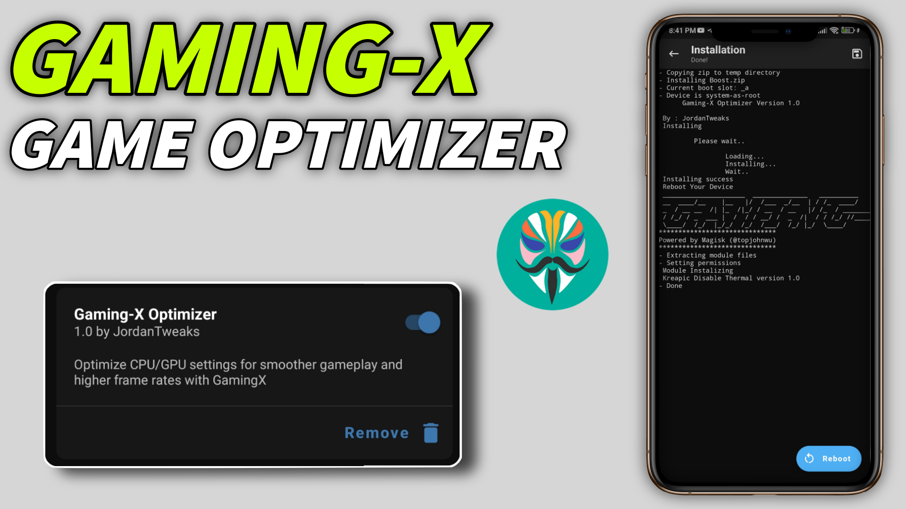

# Gaming-X Magisk Module

A Magisk module designed to optimize Android gaming performance by tweaking CPU, GPU, memory, and system settings for maximum FPS and responsiveness.

## Features
- Locks CPU cores to high-performance mode (1.9 GHz for small cores, 2.8 GHz for big cores).
- Maximizes GPU performance at 1.26 GHz.
- Optimizes ZRAM and memory management for reduced lag.
- Forces 120 FPS and high settings for supported games.
- Disables thermal throttling for sustained performance (use with caution).

## Screenshots

## Requirements
- Rooted Android device with Magisk v20.0 or higher.
- Custom recovery (e.g., TWRP) recommended for installation.
- Compatible with Android 9.0 and above.

## Installation
1. Download the latest `Gaming-X-Magisk-Module.zip` from the [Releases](https://github.com/YourGitHubUsername/Gaming-X-Magisk-Module/releases) page.
2. Open the Magisk app and go to the **Modules** tab.
3. Tap **Install from Storage** and select the downloaded ZIP file.
4. Reboot your device to apply the changes.

## Usage
- The module automatically applies optimizations at boot.
- Check the log file at `/data/adb/Gaming-X.log` for debugging.
- To uninstall, remove the module via the Magisk app and reboot.

## Warnings
- **Thermal Risk**: Disabling thermal throttling may cause overheating. Monitor your device's temperature.
- **Battery Drain**: High-performance settings increase power consumption.
- **Compatibility**: Test on your device, as some tweaks may not work on all hardware.

## Contributing
Feel free to submit issues or pull requests to improve the module. See [CONTRIBUTING.md](CONTRIBUTING.md) for details.

## License
This project is licensed under the GNU General Public License v3.0 - see the [LICENSE](LICENSE) file for details.

## Credits
- Developed by [YourGitHubUsername](https://github.com/YourGitHubUsername)
- Inspired by various Magisk modules and XDA community tweaks.
